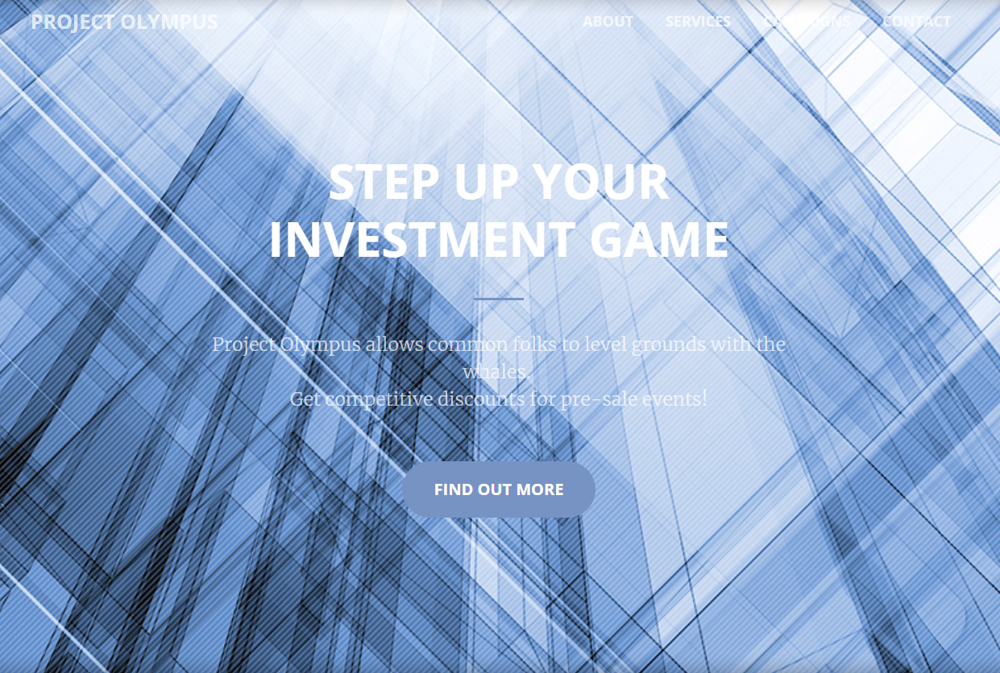
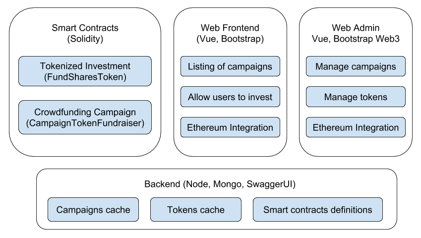
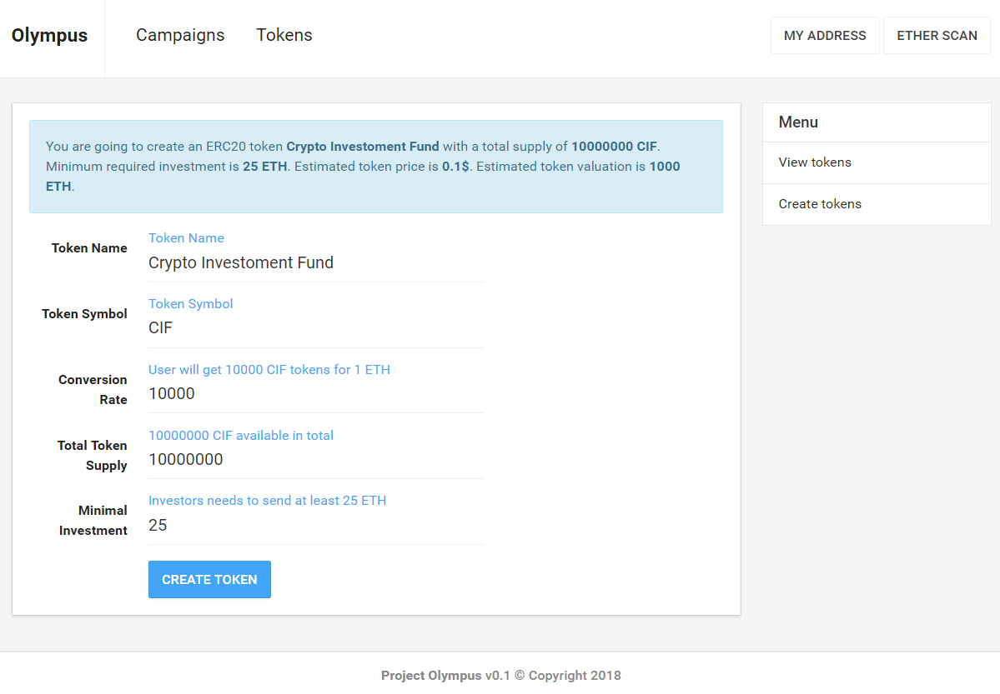
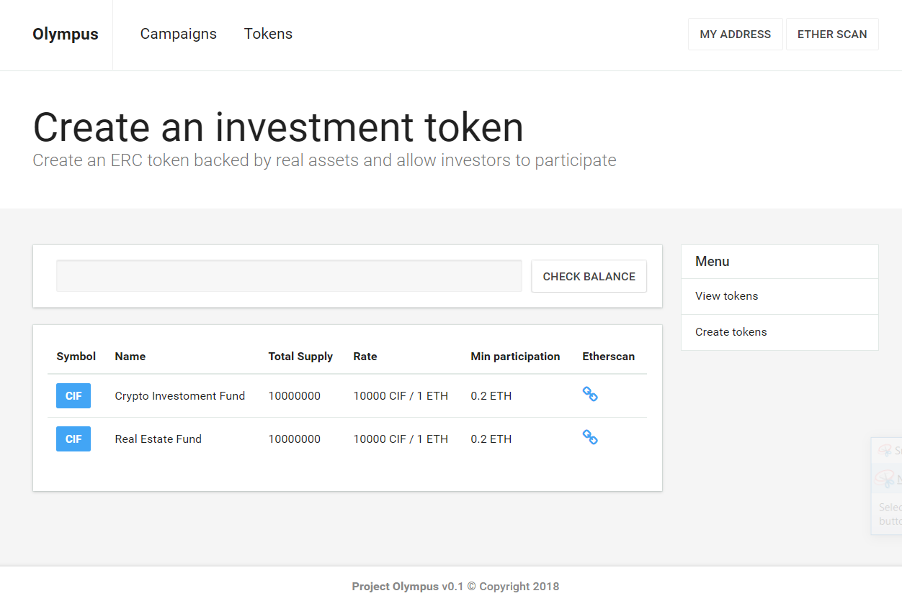
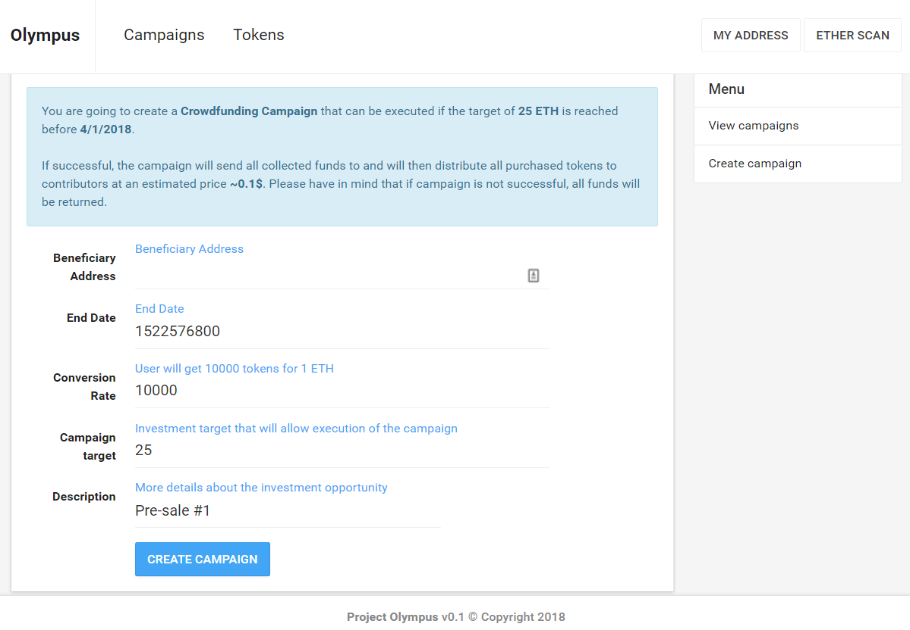
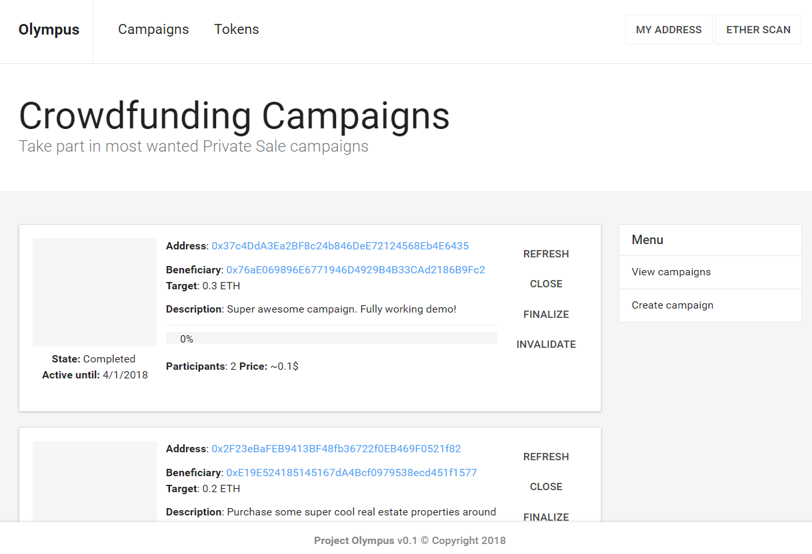

# Project Olympus

A fully-functional DApp (Decentralized Blockchain Application) that utilizes Ethereum Smart Contracts to allow common folks to become investors and level grounds with the big whales participating side by side in early deals. 

Olympus gives the power to groups of people to join forces together and participate in private sales or pre-sales events which usually require a minimum investment of 250 000 USD or more. Using Smart Contracts to facilitate the investment workflow, the blockchain solution provides transparency and security that can only be achieved via using escrow and a lot of contractual arrangements.

## Quick overview

Once you download the source code, you will notice two main sub-projects: 
* Contracts - full setup for development of smart contracts using Truffle Framework (contract compilation, linking, deployment and binary management) and Ganache (Ethereum blockchain which you can use to run tests, execute commands).
* Web - web application using three-tier architecture and integrates client-side with the Ethereum Rinkeby Test Network (via MetaMask)

The Web part is also devided into several parts:
* Backend - NodeJS server with Express and MongoDB handling the REST API and exposing documentation via SwaggerUI
* Frontend -  Simple Vue.js application with Bootstrap components containing two parts
* Frontend/Public - allowing users to participate in active campaigns via sending Ether to the campaign beneficiary. After campaign is successful, participants will receive respective amount of tokens.
* Frontend/Admin - helping administrators manage campaigns and tokens. 

## Contracts overview

The Smart Contracts are the soul of the application. They provide the core functionality of exchanging funds between different parties in trustless environment.

The business workflow is as follows:
* User tokenizes an investment - for example creates a fund that will invest in Cryptocurrencies. User can then enable other people to participate in the investment via creating an ERC20 token and specifying: `name`, `symbol`, `conversion rate`, `supply`, `minimal investment`. 
* Another user decides that he likes the idea of the first user, and wants to invest in him. However, due to the `minimal investment` requirement, he needs to invest at least 250 000 USD, which he doesn't have. This is why he organizes a campaign, and joins forces with another investors. Campaigns have `minimal target` that needs to be achieved until specified `end date` so that the campaign can be executed successfully.
* If `minimal target` is reached before the `end date`, the campaign can be closed. This action can be executed only by the campaign 8 creator and once triggered, it will send all collected funds to the `campaign beneficiary` which is the Smart Contract created by the first user. The `contract` will then send `tokens` to the campaign.
* The campaign is then `finalized` via `distributing the tokens` among all investors. Now, regular people have joined a big investment opportunity that they couldn't have done without using the blockchain and smart contracts.

## Tokenizing investment

## Managing all tokenized investments

## Creating investment campaign

## Managing all investment campaigns

